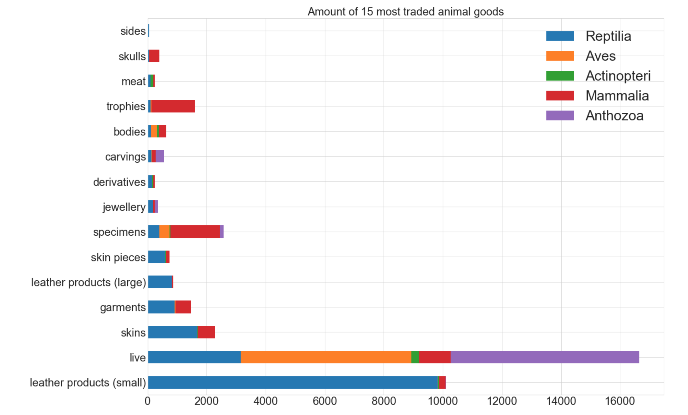

# Wildlife Trade Visualization

## [Video Demo](http://cyxu.tv/portfolio/worlds-top-wildlife-buyers-and-sellers-in-2016/)

**
This is an interactive data visualization work based on a dataset from CITES, The Convention on International Trade in Endangered Species.

Almost every member nation in the UN participates the CITES. Members are obligated to report on roughly 5000 animal species and 29000 plant species brought into or exported out of their countries, and to honor limitations placed on the international trade of these species.

This dataset includes all legal species imports and exports carried out in 2016 and reported to CITES, over 67,000 records in total.

I start off with some Python preprocessing, to better understand the structure and metrics of this dataset. Here we see it contains 16 columns, which includes taxonomy, importer / exporter, quantity of each trade, and more.

Because the dataset contains many very detailed metrics, I found it is best to represent the trades based on importer and exporters, as they provide the most intuitive information of who are the major wildlife traders in the world. Since every trade records provides the info on both parties, we can also find out the trading status between all the countries, here I selected the top 10 importers and top 10 exporters (14 in total) to demonstrate.

For the visualization, I used an algorithms called the flocking simulation which are often used in computer graphics to mimic the flock of birds, to represent each trade as a boat that delivers from the exporter to the importer. All the agents, or boats in this system are aware of it’s surroundings, each of them will find their way to the destination and avoid running into each other, align in a group and move together by constantly calculating its neighbors’ speed and direction.

**
